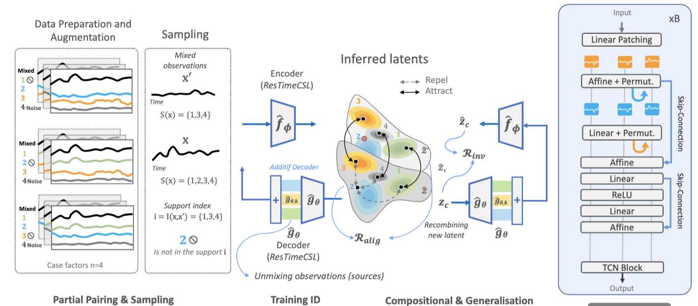
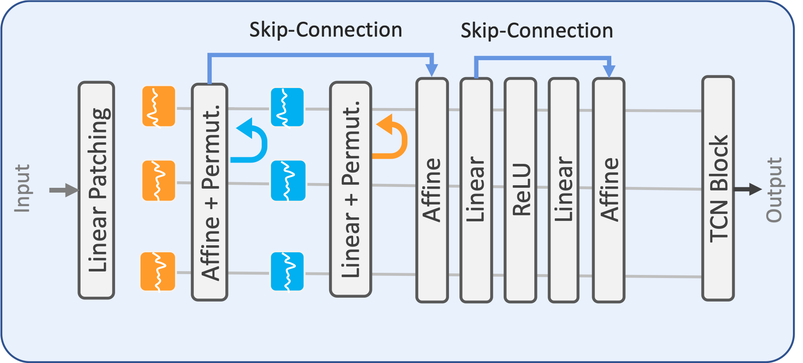

# CLEAR: Disentangling Time Series for Interpreting and Explaining Latent

The release of pretained 221 models, now available in the `checkpoints` folder and downloadable from the folder chekpoints. These models are part of our commitment to advancing machine learning and equipping the community with state-of-the-art tools for time series analysis. Visit the repository to explore the models and seamlessly integrate them into your projects.



## Environment Setup
This code was tested for Python 3.10. 

Then, set up your environment by choosing one of the following methods:

<details open>
<summary><strong>Option 1: Installing Dependencies Directly</strong></summary>

```bash
pip install -r requirements.txt
```

</details>

Or, alternatively, you can use Docker:

<details open>
<summary><strong>Option 2: Building a Docker</strong></summary>

Build and run a Docker container using the provided Dockerfile:
```bash
docker build -t CLEAR .
docker-compose up
```

</details>

## Training and Evaluation

### Training
To train the model, run the following command:

```bash
cd CLEAR/
python train.py --dataset_path "./datasets/data/ukdale.csv" --model_name "CLEAR" --num_slots 5 --epochs 200 --use_generalization_loss True
```

For complete details on the parameters, please refer to the `train.py` file.

You can find some example commands for training below:

<details open>
<summary><strong>Different Training Setups</strong></summary>

- <details>
  <summary><strong>Training SlotAttention</strong></summary>

  Training vanilla CLEAR with 5 slots (latent of size n=5 and d=16):
  ```bash
  python main.py --dataset_path "/path/from/previous/step" --model_name "CLEAR" --num_slots 5 --use_generalization_loss False
  ```

  Training vanilla iVAE with 2 slots and consistency loss:
  ```bash
  python main.py --dataset_path "/path/from/previous/step" --model_name "iVAE" --num_slots 5 --use_generalization_loss True --consistency_ignite_epoch 150
  ```

  Training SlowVAE with 2 slots, fixed SoftMax and sampling:
  ```bash
  python main.py --dataset_path "/path/from/previous/step" --model_name "SlowVAE" --num_slots 5 --use_generalization_loss True --consistency_ignite_epoch 150 --softmax False --sampling False
  ```
</details>

</details>

### Evaluation

Evaluation can be done using the `evaluate.py` script and closely follows the procedure and metrics used in the training script. The main difference is in calculating the compositional contrast (note: it might cause OOM issues, thus is calculated only for the AE model).

Here is an example command for evaluation:
```bash
python evaluation.py --dataset_path "/path/from/previous/step" --model_path "checkpoints/SlotMLPAdditive.pt" --model_name "CLEAR" --n_slot_latents 5
```

### CLEAR Architecture (using Patching) 


### Metrics for Explanation Latents and Disentanglement (RMIG, DCI, betaVAE metrics) 

We implement two types of MCC:

- **Weak MCC**: Computed after aligning sequences, measuring pattern similarity without considering order.
- **Strong MCC**: Calculated without alignment, preserving sequence order to assess accuracy.

Both metrics offer complementary insights into sequence prediction performance. Both metrics provide complementary insights into sequence prediction performance. Additional metrics can be found in the `metrics/` folder.


## 📢 Reproducing the Results from the Paper

The code used to generate the results from the experiments in Sections 5.2 to 5.6 is provided. All scripts are located in the `CLEAR/experiments/` folder. 